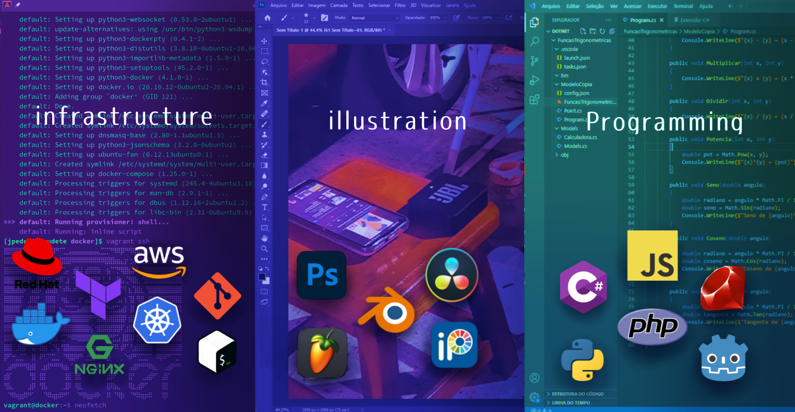

## Bem-vindo ao meu portfólio.

### Opa, beleza?
Ola, meu nome é João Pedro, tenho 22 anos e gosto de desenvolver e criar. Particularmente gosto de ilustrar as mais variadas artes e desenvolver jogos, como o design de mapas e personagens ou criar scripts para testar mecânicas dentro dos testes em Godot. Vez ou outra brincando com amigos, edito videos curtos usando Davinci Resolve ou Kdenlive para edição de video e postar em n redes sociais. E ultimamente vim desenvolvendo gosto em automatização e implantação de serviços que possam facilitar tarefas cotidianas ou que serião repetitivas para um grupo de pessoas que usam elas.
Acredito que podemos aprender e ensinar muito com a tecnologia que temos à nossa disposição, criar soluções e resolver problemas alimentados pelo cativo de “como podemos fazer isso melhor do que como está” sempre utilizando o que está à nossa disposição.   

Abaixo venho desenvolvendo algumas tecnologias:

> ☑️​Git com github e gitlab para compartilhamento de códigos. 
> 
> ​☑️​Containers em Docker e Kubernetes. 
> 
> ​☑️​Shell scripts e Python. 
> 
> ☑️Gerencia de credenciais com passbolt ou bitwarden. 
> 
> ☑️Administração de bancos com Postgresql e MariaDB. 
> 
> ☑️Diagramas e mapas de trabalho. 
> 
> ☑️Infraestrutura como Código em Terraform. 

<!--
TheCoolerJoao.md

(https://www.linkedin.com/in/jo%C3%A3o-pedro-silva-4930b023a)

**TheCoolerJoao/TheCoolerJoao** is a ✨ _special_ ✨ repository because its `README.md` (this file) appears on your GitHub profile.

Here are some ideas to get you started:

- 🔭 I’m currently working on ...
- 🌱 I’m currently learning ...
- 👯 I’m looking to collaborate on ...
- 🤔 I’m looking for help with ...
- 💬 Ask me about ...
- 📫 How to reach me: ...
- 😄 Pronouns: ...
- ⚡ Fun fact: ...
-->
