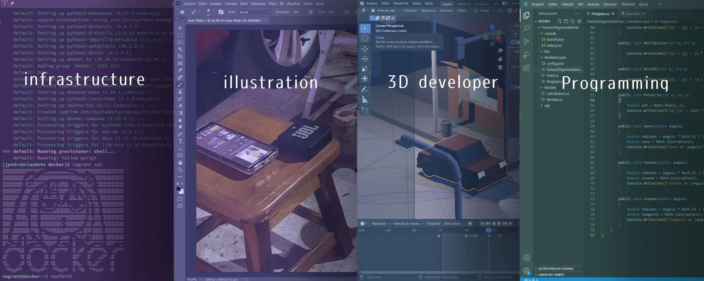

## Bem-vindo ao meu portfólio.

### Desenvolvedor e ilustrador de dia.
Algumas ferramentas utilizadas antes das 18h: visual studio code, github, vmware, docker, ibispaint.

### Modelador e animador 2D e 3D de noite.
Algumas ferramentas utilizadas depois das 18h: blender, premiere pro, unity, krita.

<!--
TheCoolerJoao.md

(https://www.linkedin.com/in/jo%C3%A3o-pedro-silva-4930b023a)

**TheCoolerJoao/TheCoolerJoao** is a ✨ _special_ ✨ repository because its `README.md` (this file) appears on your GitHub profile.

Here are some ideas to get you started:

- 🔭 I’m currently working on ...
- 🌱 I’m currently learning ...
- 👯 I’m looking to collaborate on ...
- 🤔 I’m looking for help with ...
- 💬 Ask me about ...
- 📫 How to reach me: ...
- 😄 Pronouns: ...
- ⚡ Fun fact: ...
-->
